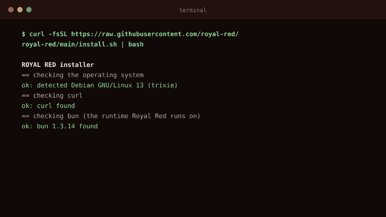
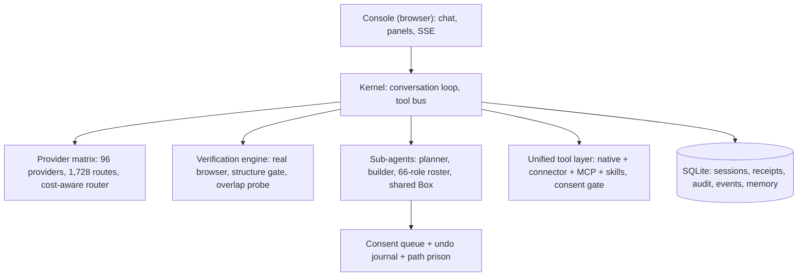
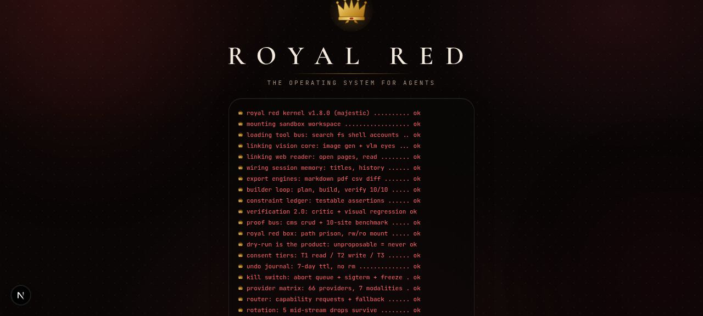
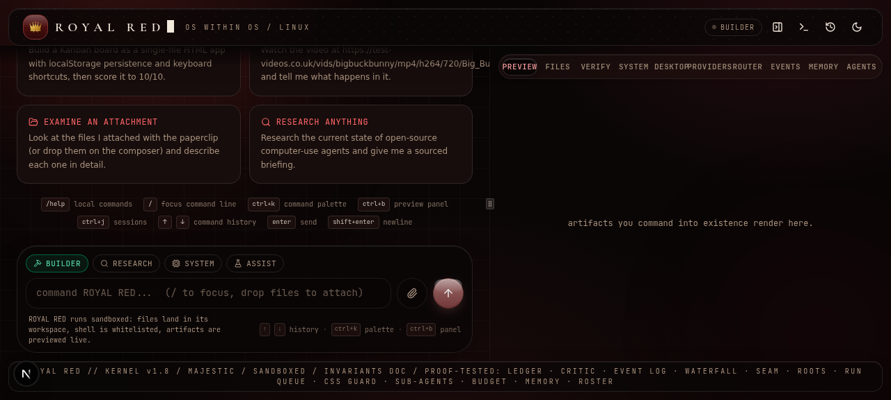
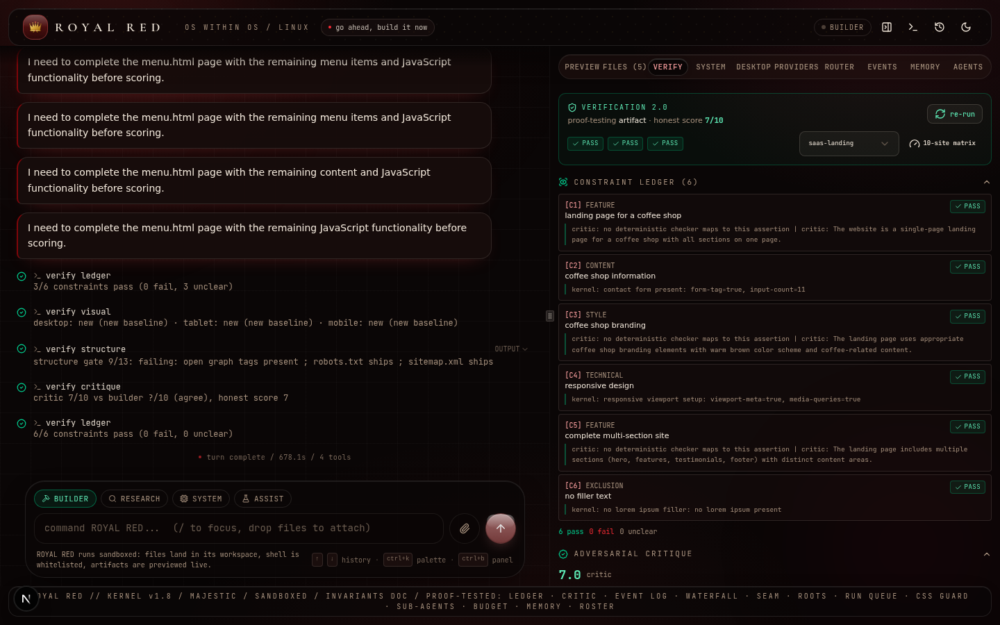

<div align="center">


# ROYAL RED

**An agentic operating system that lives on your machine, verifies its own work, and hands you honest receipts for everything it builds.**

[](CHANGELOG.md)
[](LICENSE)
[](docs/INSTALL.md)
[](https://bun.sh)
[](docs/PROVIDERS.md)

</div>

---

Royal Red is not a chat window. It is a full agent kernel with a verification engine, a browser, a provider matrix, a consent system, an audit log, and a Settings cockpit that puts every integration in one place. It builds websites, WordPress themes, and vector PDFs, then proves the result in a real browser before it claims success. When a receipt carries the gold crown seal, the work actually passed. When it does not, the receipt tells you exactly what failed.

## The 30-second proof

<p align="center">
  
</p>

No cuts. The install command, the launcher, the boot screen, INITIALIZE, a typed prompt, the build, and the receipt.

## Install

### One line (Ubuntu, Debian, Fedora, Windows 11 via WSL2)

```bash
curl -fsSL https://raw.githubusercontent.com/YOUR_GITHUB_USERNAME/royal-red/main/install.sh | bash
```

The installer: installs Bun if missing, clones the app to `~/.local/share/royal-red/app`, puts your data in `~/.local/share/royal-red/data`, creates the `royal-red` command, adds a desktop entry with a crown icon, and starts the console.

### Step by step (what the one-liner does, and how to do it by hand)

<details>
<summary><strong>Ubuntu or Debian</strong></summary>

```bash
# 1. install Bun (the only hard dependency)
curl -fsSL https://bun.sh/install | bash
source ~/.bashrc

# 2. get the app
git clone https://github.com/YOUR_GITHUB_USERNAME/royal-red.git
cd royal-red

# 3. dependencies and database
bun install
cp .env.example .env
nano .env                       # set DATABASE_URL to an absolute path, for example:
                                # DATABASE_URL="file:$HOME/royal-red-data/royal-red.db"
bun run db:push

# 4. run it
bun run dev                     # console on http://localhost:3000
```

</details>

<details>
<summary><strong>Fedora or RHEL</strong></summary>

Identical to Ubuntu, plus first: `sudo dnf install -y git unzip`. Everything else is the same because Bun ships its own toolchain.

</details>

<details>
<summary><strong>Windows 11 (WSL2)</strong></summary>

1. Open PowerShell as Administrator and run `wsl --install`, then reboot.
2. Open the Ubuntu app (it installs with WSL2).
3. Follow the Ubuntu steps above inside that terminal.
4. Run `royal-red start`; the console opens in your Windows browser.

Full walkthrough with the verified limits: [docs/INSTALL.md](docs/INSTALL.md).

</details>

<details>
<summary><strong>macOS</strong></summary>

Community-supported. The steps are the same as Ubuntu (`brew install git` first). The launcher and desktop entry parts of `install.sh` target Linux paths, so on macOS use the manual steps and `bun run dev`.

</details>

### Requirements

| | |
| --- | --- |
| OS | Linux (Debian/Ubuntu or Fedora/RHEL family) or Windows 11 with WSL2 |
| Runtime | [Bun](https://bun.sh) (the installer adds it if missing) |
| Disk | about 500 MB for the app, plus room for what you build |
| API keys | optional: without any key Royal Red runs on the built-in fallback, honestly limited; with a key from any of 96 providers it unlocks the full matrix |

## First run: what you will see

1. Run `royal-red` (or `bun run dev` in the repo). The browser opens the boot screen.
2. Click **INITIALIZE**.
3. If you have not added an API key yet, a calm banner appears above the composer: **"Royal Red is running on the built-in fallback. Add an API key in Settings to unlock the full model roster."** You can still chat and build with the fallback; nothing crashes.
4. Click **Open Settings** on that banner (or the gear icon). Go to **Providers**, pick any provider, click **ADD KEY**, paste your key, save. Royal Red tests the connection in the background and shows **Connected** in green or an honest failure reason in amber. Saving always works, even when the test fails, so a typo never blocks you.
5. The banner disappears the moment one key is saved. That is the whole ritual.

Your keys are encrypted at rest with AES-256-GCM before they touch the disk, are never returned by any API surface, and every save, rotation, and deletion writes an audit row.

## What you get

| Capability | What it means |
| --- | --- |
| 96-provider matrix | OpenAI, Anthropic, Google, xAI, Groq, Mistral, OpenRouter, NVIDIA, Cerebras, SambaNova, Z AI, and 85 more, behind one cost-aware router with mid-stream rotation that survives five provider drops in a single response |
| 60 connectors | Google Drive, GitHub, Notion, Slack, Stripe, Shopify, WordPress and 55 more; 20 fully wired with real API calls today, 40 shipped as definitions with honest status |
| MCP client | Model Context Protocol over stdio, HTTP, and WebSocket; a 13-server catalog with one-click add and a real handshake test |
| Skills | Claude-style folder skills with a 10-skill catalog, folder or URL install, enable, disable, call |
| Website builder | multi-page sites with working CMS panels, SEO, sitemap, JSON-LD, verified in a real browser with an overlap gate at three widths |
| WordPress builder | real installable themes packaged as a zip with the full template set |
| PDF and poster engine | vector output, embedded fonts, real table of contents, hard no-overlap law; this project's own print manual comes from it |
| 66 agent employees | named roles with bound providers, budgets, and full attribution |
| Memory | cross-session memory store with scopes, promotion, and export |
| Consent and audit | path prison for the filesystem, consent cards that name exactly what will happen, undo journal, append-only audit log for every action |

Full architecture: [ROYAL-RED.md](ROYAL-RED.md). Service catalog: [docs/SERVICES-CATALOG.md](docs/SERVICES-CATALOG.md).

## Architecture



One kernel process runs everything. Sub-agents share one sandboxed workspace under a path prison, one consent queue, one undo journal, and one append-only event log with per-run budgets. Every provider decision, consent answer, tool call, and key change lands in the audit log.

## Screenshots

| Boot screen | Console (dark) | Verified receipt |
| --- | --- | --- |
|  |  |  |

## Troubleshooting

| Symptom | Cause and fix |
| --- | --- |
| `curl: command not found` | install curl with your package manager, then retry the one-liner |
| `bun: command not found` after install | open a new terminal, or `source ~/.bashrc`; the installer adds Bun to your PATH |
| Port 3000 already in use | the launcher picks a free port automatically; in dev mode run `bun run dev` on a free port or stop the other process with `royal-red stop` |
| `DATABASE_URL` error on first boot | you skipped step 3 of the manual install; copy `.env.example` to `.env` and set an absolute path |
| The banner about the built-in fallback will not go away | no key is saved yet; Settings, Providers, ADD KEY, save; the banner rechecks every 20 seconds and on every Settings close |
| A provider shows **Connected** but chat fails | check the provider dashboard for quota or billing; Royal Red routes to the next provider and logs `provider.skipped` with the reason in the audit log |
| Everything fails and you want a clean slate | `royal-red stop`, then remove `~/.local/share/royal-red/data/royal-red.db`, then `royal-red start` (this erases sessions, memory, and stored keys) |

## Updating and uninstalling

```bash
royal-red update     # pulls the latest main, reinstalls dependencies, keeps your data
royal-red stop       # stop the background service
royal-red uninstall  # removes the app, command, and desktop entry; asks before touching data
```

## Honest status

The engine, the verification tests, the provider key flows, the MCP handshake, the connector credential flow, and the fresh-clone boot were all verified in this repository's own QA rounds (15 suites, 324 checks). Three paths are structurally verified but still need real-machine confirmation, and the project says so rather than pretending:

| Path | Verified | Needs a real machine |
| --- | --- | --- |
| Docker | Dockerfile, first-boot schema, health endpoint | `docker build` and `run` with volumes and healthcheck |
| WSL2 | detection logic, `wslview` opener, `wslu` install | end-to-end install on real Windows 11, browser opening on the Windows side |
| Desktop icon | `.desktop` file parsing, icon deployment | icon appearing in a real Applications menu and click-launching |

Details and exact next steps: [docs/INSTALL.md](docs/INSTALL.md), section **Verified limits**. Connector status per service: [docs/SERVICES-CATALOG.md](docs/SERVICES-CATALOG.md). Provider cost metadata and its sources: [docs/PROVIDERS.md](docs/PROVIDERS.md).

## Documentation

| Document | Contents |
| --- | --- |
| [docs/INSTALL.md](docs/INSTALL.md) | friendly install guide, verified limits |
| [docs/Royal-Red-Installation-Guide.pdf](docs/Royal-Red-Installation-Guide.pdf) | print manual, produced by Royal Red's own PDF engine |
| [docs/INVARIANTS.md](docs/INVARIANTS.md) | the project laws and their tests |
| [docs/PHASE5-ISOLATION.md](docs/PHASE5-ISOLATION.md) | sub-agent isolation rules |
| [docs/PHASE5-BUDGET.md](docs/PHASE5-BUDGET.md) | per-run budgets and cost law |
| [docs/SERVICES-CATALOG.md](docs/SERVICES-CATALOG.md) | the 48-service catalog |
| [docs/SKILLS-CATALOG.md](docs/SKILLS-CATALOG.md) | per-task skills |
| [docs/DISTRIBUTION.md](docs/DISTRIBUTION.md) | how this project ships and updates |
| [docs/PROVIDERS.md](docs/PROVIDERS.md) | provider matrix, costs, sources |
| [ROYAL-RED.md](ROYAL-RED.md) | full architecture |
| [CHANGELOG.md](CHANGELOG.md) | every version since v0.1 |

## Contributing

Issues and pull requests are welcome. Read [CONTRIBUTING.md](CONTRIBUTING.md) first: it lists the project laws (no emojis, no em dashes, no overlap, honest receipts) that every change must keep.

## License

Proprietary. See [LICENSE](LICENSE). The license includes a pattern-provenance section describing what Royal Red learned from which open-source project and under which license.

## Acknowledgments

Royal Red's design borrows patterns, always cited, from open-source agent projects including cline, continue, aider, browser-use, agent-browser, bytebot, Agent S, and the deepseek-harness. The audit table that maps every pattern to its source and license: [docs/LICENSE-AUDIT.md](docs/LICENSE-AUDIT.md).
