<div align="center">
  
</div>

# Download and run Royal Red: the complete step-by-step guide

This guide gets Royal Red running on your machine from zero, even if you have never used a terminal before. Follow the path for your operating system. Every step is one command you can copy and paste.

<div align="center">
  
</div>

Prefer print? The same guide exists as a royal-red and gold PDF manual, built by the project's own PDF engine: [Royal-Red-Download-and-Install-Guide.pdf](Royal-Red-Download-and-Install-Guide.pdf).

## Which path is yours

| You are on | Use this path |
| --- | --- |
| Windows 11 | Path A: install WSL2, then the one-liner (or Path C) |
| Ubuntu / Debian / Fedora Linux | Path B: the one-liner |
| macOS | Path C: clone and run |
| I just want to look at the code | Path D: download as ZIP |

---

## Path A: Windows 11 (step by step)

1. **Open PowerShell as Administrator.** Click Start, type `powershell`, right click, Run as administrator.
2. **Install WSL2** (a real Linux running inside Windows, this is the official Microsoft way):

   ```powershell
   wsl --install
   ```

3. **Restart the computer** when it asks.
4. A window called **Ubuntu** opens (or open it from the Start menu). It asks for a username and password. Pick anything you remember. This is only for Linux inside Windows, not your Windows password.
5. **In that Ubuntu window**, run the one-line install:

   ```bash
   curl -fsSL https://raw.githubusercontent.com/muhammadwhizz-web/royal-red/main/install.sh | bash
   ```

6. When it finishes, start Royal Red:

   ```bash
   royal-red
   ```

7. Your **Windows browser** opens the Royal Red console. Click **INITIALIZE**.
8. Done. To stop it later: `royal-red stop`. To start it again: open Ubuntu, type `royal-red`.

Verified-limits note: the WSL2 path is documented in docs/INSTALL.md as structurally verified (detection logic, browser opener); the end-to-end run on real Windows hardware is the part we ask you to report if anything differs.

## Path B: Linux (Ubuntu, Debian, Fedora), one line

```bash
curl -fsSL https://raw.githubusercontent.com/muhammadwhizz-web/royal-red/main/install.sh | bash
```

Then:

```bash
royal-red
```

The browser opens, click **INITIALIZE**, done.

## Path C: clone it (any system, best for the future)

Use this if you want to keep up with updates, contribute, or run on macOS.

1. **Install Bun** (the only dependency), from https://bun.sh or:

   ```bash
   curl -fsSL https://bun.sh/install | bash
   ```

   Close and reopen the terminal so `bun` is on your PATH.

2. **Get the code:**

   ```bash
   git clone https://github.com/muhammadwhizz-web/royal-red.git
   cd royal-red
   ```

3. **Install dependencies:**

   ```bash
   bun install
   ```

4. **Create your environment file:**

   ```bash
   cp .env.example .env
   ```

5. **Point the database at a real file.** Open `.env` in any editor and set DATABASE_URL to an absolute path, for example:

   ```
   DATABASE_URL="file:/home/YOURNAME/royal-red-data/royal-red.db"
   ```

   (macOS example: `file:/Users/YOURNAME/royal-red-data/royal-red.db`)

6. **Create the database:**

   ```bash
   bun run db:push
   ```

7. **Run it:**

   ```bash
   bun run dev
   ```

8. Open **http://localhost:3000**, click **INITIALIZE**.

## Path D: download as ZIP (no terminal knowledge at all)

1. Open https://github.com/muhammadwhizz-web/royal-red
2. Click the green **Code** button, then **Download ZIP**
3. Unzip it anywhere
4. You still need Bun and a terminal for the rest, so if you got this far, Path C is honestly easier. The ZIP is perfect for reading the code and the docs.

---

## First run: the two-minute ritual

1. The console opens with a boot screen. Click **INITIALIZE**.
2. If you have no API key yet, a calm amber banner appears: **"Royal Red is running on the built-in fallback."** This is normal. Nothing is broken. You can chat and build right now, with honest limits.
3. To unlock the full 96-provider roster: click **Open Settings** on that banner (or the gear icon), go to **Providers**, pick any provider, click **ADD KEY**, paste your key, save.
4. Royal Red tests the key in the background and shows **Connected** in green, or the provider's real error in amber. Either way the key is saved and encrypted (AES-256-GCM) before it touches the disk.
5. The banner disappears the moment one key is saved. That is the whole ritual.

## Keeping it updated (Path C users)

```bash
cd royal-red
git pull
bun install
bun run db:push
```

Your data (sessions, memory, audit log, encrypted keys) lives in your own database file and survives every update. Installer users can just run `royal-red update`.

## If something goes wrong

| Symptom | Fix |
| --- | --- |
| `curl: command not found` | Windows: you are in PowerShell, use the Ubuntu window instead. Linux: `sudo apt install curl` (or `sudo dnf install curl`) |
| `bun: command not found` | close and reopen the terminal, or `source ~/.bashrc` |
| Port 3000 busy | stop the other process, or `royal-red stop`, then start again |
| `DATABASE_URL` error | you skipped step 5 of Path C; the path must be absolute |
| Everything broken, start clean | stop Royal Red, delete your `royal-red.db` file, start again (erases sessions, memory, and stored keys) |

More help: open an issue at https://github.com/muhammadwhizz-web/royal-red/issues
